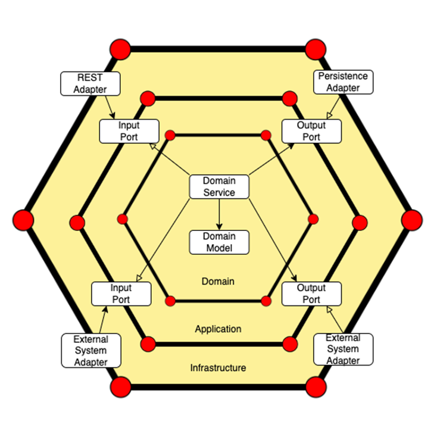
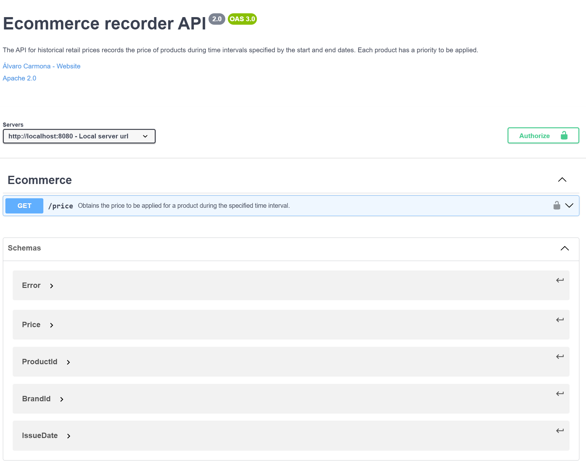
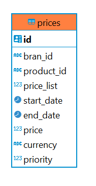
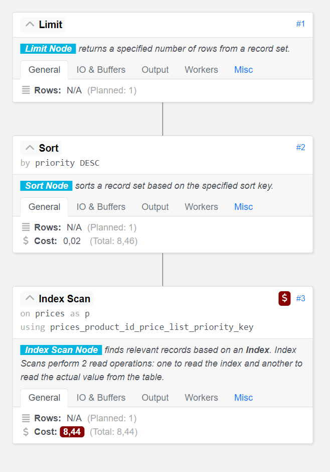
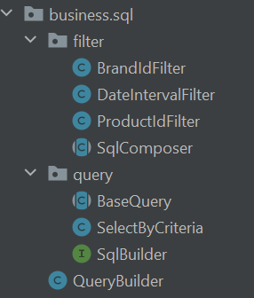

<!-- PROJECT SHIELDS -->
<!--
*** Reference links are enclosed in brackets [ ] instead of parentheses ( ).
*** See the bottom of this document for the declaration of the reference variables
*** for contributors-url, forks-url, etc. This is an optional, concise syntax you may use.
-->
[![Contributors][contributors-shield]][contributors-url]
[![Stargazers][stars-shield]][stars-url]
[![Issues][issues-shield]][issues-url]
[![MIT License][license-shield]][license-url]
[![LinkedIn][linkedin-shield]][linkedin-url]

<!-- PROJECT LOGO -->
 

<h3 align="center">BC ECOMMERCE RECORDER</h3>

  

    The API for historical retail prices records the price of products during time intervals specified by the start and end dates. Each product has a priority to be applied.
     
    <a href="https://github.com/alvcarpal/bc-ecommerce-recorder"><strong>Explore the docs »</strong></a>
     
     
    <a href="https://github.com/alvcarpal/bc-ecommerce-recorder/blob/master/src/main/resources/demo">View Demo</a>
    ·
    <a href="https://github.com/alvcarpal/bc-ecommerce-recorder/issues">Report Bug</a>
    ·
    <a href="https://github.com/alvcarpal/bc-ecommerce-recorder/pulls">Request Feature</a>
  

<!-- TABLE OF CONTENTS -->

  
Table of Contents

  <ol>
    <li>
      <a href="#about-the-project">About The Project</a>
      <ul>
        <li><a href="#data-model">Data model</a></li>
        <li><a href="#custom-query-builder">Custom Query Builder</a></li>
        <li><a href="#built-with">Built With</a></li>
      </ul>
    </li>
    <li>
      <a href="#getting-started">Getting Started</a>
      <ul>
        <li><a href="#prerequisites">Prerequisites</a></li>
        <li><a href="#installation">Installation</a></li>
        <li><a href="#testing">Testing</a></li>
      </ul>
    </li>
    <li><a href="#license">License</a></li>
    <li><a href="#contact">Contact</a></li>
  </ol>

<!-- ABOUT THE PROJECT -->
## About The Project

The project implements the 'hexagonal' or 'adapters and ports' architecture, aligning with the increasingly prevalent Clean Code paradigm.

Adapter: An adapter in the Hexagonal Architecture is the concrete implementation that connects the internal system to external components, adhering to the rules defined by a corresponding port. Adapters handle the translation of requests between the system and external entities, managing the necessary logic for effective communication and ensuring that the core system remains independent of specific external implementations.

Port: In the Hexagonal Architecture, a port serves as an abstract interface defining how the internal system interacts with the external world. It establishes clear contracts for input and output interactions, acting as a point of connection between the core system and external entities such as user interfaces, external services, or databases. Ports provide a structured and abstract representation of the system's needs from an external interaction perspective.

Image: Hexagonal architecture representation

There are many benefits to this architecture, but the following should be highlighted:

* Decoupling: The system is divided into layers, and these layers communicate through ports (interfaces) using adapters (implementations), achieving a high level of decoupling between layers.
* Separation of Responsibilities: Three layers—infrastructure, application, and domain—are established, each with a clear objective. 
* Scalability: We can easily add new external elements by simply adding a port and providing an adapter.

We use a Contract First approach, so it is necessary to generate an api.yaml file in src/main/resources/api with the API definition in OpenAPI format (Swagger file).

During the package phase of the Maven lifecycle, the DTOs and controller interfaces will be automatically generated according to the specifications in the src/main/resources/api/api.yaml file. During the clean phase, all auto-generated DTOs and controller interfaces will be deleted.

Image: Endpoints' paths

The endpoints are as follows:

* GET /price: Obtains the retail price of the product (product_id) for the interval that matches
  the provided execution date. In case multiple applicable prices are found, the one with the highest
  numerical priority should be applied.

In addition, openapi code generation plugin should be configured as follows:

            <!-- OpenAPI code generation-->
            <plugin>
                <groupId>org.openapitools</groupId>
                <artifactId>openapi-generator-maven-plugin</artifactId>
                <version>${openapi-generator-maven-plugin.version}</version>
                <executions>
                    <execution>
                        <goals>
                            <goal>generate</goal>
                        </goals>
                        <configuration>
                            <inputSpec>src/main/resources/api/api.yaml</inputSpec>
                            <generatorName>spring</generatorName>
                            <output>./</output>
                            <modelPackage>com.bc.ecommerce.infrastructure.rest.spring.dto</modelPackage>
                            <apiPackage>com.bc.ecommerce.infrastructure.rest.spring.spec</apiPackage>
                            <modelNameSuffix>Dto</modelNameSuffix>
                            <generateApiDocumentation>false</generateApiDocumentation>
                            <generateModelDocumentation>false</generateModelDocumentation>
                            <generateSupportingFiles>true</generateSupportingFiles>
                            <supportingFilesToGenerate>ApiUtil.java</supportingFilesToGenerate>
                            <configOptions>
                                <sourceFolder>src/main/java</sourceFolder>
                                <java8>true</java8>
                                <interfaceOnly>true</interfaceOnly>
                            </configOptions>
                        </configuration>
                    </execution>
                </executions>
            </plugin>

(<a href="#readme-top">back to top</a>)

### Data model

When designing our model, it is essential to optimize queries as much as possible to retrieve information about prices.

In this way, the first step is to define our E-R model. In this case, the following scenario has been assumed for the exercise:

* A product must be unique for a price list, and there can only be the same product with the same priority. In this way, we define UNIQUE(product_id, price_list, priority), achieving this constraint. 
This decision is made because it is not logical to have the same product with the same priority for a price list
* Since there is no need for additional search for chain information (brand_id), a Brand table has not been created to store such information. In the future, brand_id can be configured as a foreign key to a Brand table, 
allowing not only the product price but also obtaining information about its brand.
* It is assumed that the same product can belong to multiple chains (brand_id) for simplicity. Another possible constraint to discuss would be this requirement.

Image: Data model

The first step will be to analyze the execution plan of our query. Since we only have one table, the most favorable scenario will be when an INDEX_SCAN is performed, avoiding the need to traverse the entire table (SEQ_SCAN).

    EXPLAIN (FORMAT JSON) SELECT p.id, p.bran_id, p.product_id, p.price_list, p.start_date, p.end_date, p.price, p.currency, p.priority
    FROM public.prices p
    WHERE p.product_id = '1'
    AND p.bran_id = '1'
    AND ('2020-06-14T09:31:26.075Z' BETWEEN p.start_date AND p.end_date)
    ORDER BY priority DESC
    LIMIT 1;

In this case, with the UNIQUE constraint, a composite index is already created for those fields, which will be applied even if a search is not performed on all of them. Therefore, there is no need to add any additional indexes.

Image: Query plan analyze

The most favorable scenario is observed, in which, as mentioned, a search is performed using the index created by UNIQUE. This is because a search is carried out based on the product_id field.

With each modification to the query, the execution plan should be reviewed to ensure that it is not adversely affected, and that any changes do not worsen its performance.

Finally, projection interface provides a list of specific columns that should be selected in a query. The list includes attributes from the prices' entity. This list of columns is used to construct SQL queries and select only the specific attributes of the prices entity needed in the query.

(<a href="#readme-top">back to top</a>)

### Custom Query Builder

A custom criteria builder is created to build a dynamic SQL query construction engine. This allows defining new filters and queries at any time using the Composite structural pattern, following the SOLID open-close principle.

1. SqlComposer<T> Class: An abstract class serving as the base component in the Composite pattern.
It has a sqlBuilder field representing the SQL query builder (DefaultCustomQueryBuilder).
Declares an abstract method apply(T criteria) to be implemented by concrete classes extending this class. This method is responsible for applying a specific criterion and constructing the corresponding part of the SQL query.

2. ProductIdFilter Class (Example of a Concrete Class): Extends SqlComposer<String), specializing the base class to handle specific criteria related to the product identifier (String in this case).
Implements apply(String productId) method, which uses the sqlBuilder to generate the SQL query part corresponding to the product identifier criteria.

3. SelectByCriteria Class: Extends BaseQuery<PricesCriteria> and represents a composite query that uses multiple criteria.
In the build(PricesCriteria criteria) method, instances of classes such as ProductIdFilter, BrandIdFilter, and DateIntervalFilter are used to apply specific criteria in a composite manner using the Composite pattern.
The SQL query is constructed using the sqlBuilder and parts generated by different filters, applying a composite criterion using the and method.

In this way, multiple queries can be constructed by simply adding a new class in business.sql.query and adding filters in business.sql.filter.

    public CustomQuery build(PricesCriteria criteria) {
        return sqlBuilder.select(new PricesDbo(), PricesTable.NAME)
              .where(sqlBuilder.and(
                    productIdComposer.apply(criteria.getProductId()),
                    brandIdComposer.apply(criteria.getBrandId()),
                    dateIntervalComposer.apply(criteria.getIssueDate())
                    myFilterComposer.applu(criteria.getMyFilter())
              )).sortBy(PricesTable.PRIORITY.getName())
             .limit();
    }

Applying a new filter (myFilter) is as simple as adding it to the desired query.

Finally, it is possible to define any new operation to add to the native query constructed in DefaultCustomQueryBuilder. An example would be adding the OR clause, which is not included as it is not necessary.

(<a href="#readme-top">back to top</a>)

### Built With

This section should list any major frameworks/libraries used to bootstrap your project. 

* [![JAVA][Java.com]][Java-url]
* [![SPRING][Spring.com]][Spring-url]
* [![SQL][SQL.com]][SQL-url]
* [![GIT][GIT.com]][GIT-url]
* [![HIBERNATE][Hibernate.com]][Hibernate-url]

(<a href="#readme-top">back to top</a>)

<!-- GETTING STARTED -->
## Getting Started

To begin with, the necessary technologies to install are listed, along with instructions on how to start running the project.

### Prerequisites

To be able to run the project locally, you will need to have installed:

* [![JAVA][Java.com]][Java-11-url] 11
* [![GIT][GIT.com]][GIT-url]
* [![INTELLIJ][IntelliJ.com]][IntelliJ-url]

(<a href="#readme-top">back to top</a>)

### Installation

To start the microservice with local configuration, you can execute the following command:

    mvn spring-boot:run -Dspring.profiles.active=local

In the default profile, an integrated H2 database with Flyway has been configured.

If you want to query the H2 database, you can do so through the browser using the following URL:

    http://localhost:8080/h2-console

At the following path, you can find a collection for POSTMAN. Some linters, such as Sonar, may detect sending a token in the Authorization field as a vulnerability, so this should be taken into account.

[![POSTMAN][POSTMAN.com]][POSTMAN-url]

(<a href="#readme-top">back to top</a>)

### Testing

In addition to the POSTMAN collection, various integration tests are conducted to ensure its proper functioning.

There is a parameterized test in com.bc.ecommerce.integration.rest so that we can define the input data (parameters in the query) and the expected result in infrastructure.rest.output.

-     {"product_id":"35455", "brand_id":"1", "issue_date":"2020-06-14T10:00:00.000Z", "price_test_1_get.json"}
-     {"product_id":"35455", "brand_id":"1", "issue_date":"2020-06-14T16:00:00.000Z", "price_test_2_get.json"}
-     {"product_id":"35455", "brand_id":"1", "issue_date":"2020-06-14T21:00:00.000Z", "price_test_1_get.json"}
-     {"product_id":"35455", "brand_id":"1", "issue_date":"2020-06-15T10:00:00.000Z", "price_test_3_get.json"}
-     {"product_id":"35455", "brand_id":"1", "issue_date":"2020-06-16T21:00:00.000Z", "price_test_4_get.json"}

(<a href="#readme-top">back to top</a>)

<!-- LICENSE -->
## License

Distributed under the MIT License. See `LICENSE.txt` for more information.

(<a href="#readme-top">back to top</a>)

<!-- CONTACT -->
## Contact

Álvaro Carmona - [@acarmona](https://www.linkedin.com/in/%C3%A1lvaro-carmona-palomares/) 

Project Link: [https://github.com/alvcarpal/bc-ecommerce-recorder](https://github.com/alvcarpal/bc-ecommerce-recorder)

(<a href="#readme-top">back to top</a>)

<!-- MARKDOWN LINKS & IMAGES -->
<!-- https://www.markdownguide.org/basic-syntax/#reference-style-links -->
[contributors-shield]: https://img.shields.io/github/contributors/alvcarpal/bc-ecommerce-recorder.svg?style=for-the-badge
[contributors-url]: https://github.com/alvcarpal/bc-ecommerce-recorder/graphs/contributors
[stars-shield]: https://img.shields.io/github/stars/alvcarpal/bc-ecommerce-recorder.svg?style=for-the-badge
[stars-url]: https://github.com/alvcarpal/bc-ecommerce-recorder/stargazers
[issues-shield]: https://img.shields.io/github/issues/alvcarpal/bc-ecommerce-recorder.svg?style=for-the-badge
[issues-url]: https://github.com/alvcarpal/bc-ecommerce-recorder/issues
[license-shield]: https://img.shields.io/github/license/othneildrew/Best-README-Template.svg?style=for-the-badge
[license-url]: https://github.com/alvcarpal/bc-ecommerce-recorder/blob/master/LICENSE.txt
[linkedin-shield]: https://img.shields.io/badge/-LinkedIn-black.svg?style=for-the-badge&logo=linkedin&colorB=555
[linkedin-url]: https://www.linkedin.com/in/%C3%A1lvaro-carmona-palomares/
[Java.com]: https://img.shields.io/badge/Java-ED8B00?style=for-the-badge&logo=openjdk&logoColor=white
[Java-url]: https://www.java.com/es/
[Spring.com]: https://img.shields.io/badge/Spring-6DB33F?style=for-the-badge&logo=spring&logoColor=white
[Spring-url]: https://spring.io/
[SQL.com]: https://img.shields.io/badge/PostgreSQL-316192?style=for-the-badge&logo=postgresql&logoColor=white
[SQL-url]: https://www.postgresql.org/
[GIT.com]: https://img.shields.io/badge/GIT-E44C30?style=for-the-badge&logo=git&logoColor=white
[GIT-url]: https://git-scm.com/
[Hibernate.com]: https://img.shields.io/badge/Hibernate-59666C?style=for-the-badge&logo=Hibernate&logoColor=white
[Hibernate-url]: https://hibernate.org/
[IntelliJ.com]: https://img.shields.io/badge/IntelliJ_IDEA-000000.svg?style=for-the-badge&logo=intellij-idea&logoColor=white
[IntelliJ-url]: https://www.jetbrains.com/idea/download/?section=windows
[Java-11-url]: https://jdk.java.net/11/
[POSTMAN.com]: https://img.shields.io/badge/postman%20-F79114?style=for-the-badge&logo=postman%20pay&logoColor=white
[POSTMAN-url]: https://github.com/alvcarpal/bc-ecommerce-recorder/blob/master/src/main/resources/collection

